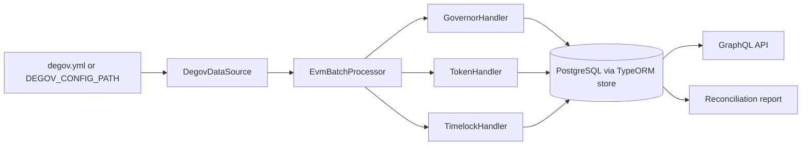

# DeGov Indexer Architecture

This document describes the current `packages/indexer` implementation on top of the integrated OHH-32 to OHH-38 branch.

## Runtime topology

## Main entrypoints

### Processor startup

`src/main.ts` is the processor entrypoint:

1. Read `DEGOV_CONFIG_PATH`.
2. Load and normalize the DAO config through `DegovDataSource`.
3. Select RPC endpoints from `CHAIN_RPC_<chainId>` when present, otherwise fall back to the config file RPC list.
4. Build an `EvmBatchProcessor` with the configured finality, capacity, gateway, and batch-call settings.
5. Subscribe to logs for the configured `governor`, `governorToken`, and `timeLock` contracts.
6. Route each matched log into the corresponding handler.

### GraphQL and local helper entrypoints

- `npx sqd serve` starts the GraphQL API on top of the indexed PostgreSQL state.
- `scripts/start.sh` applies migrations and starts the processor.
- `scripts/graphql-server.sh` starts the GraphQL server directly.
- `scripts/smart-start.sh` is the local convenience wrapper for Docker, code generation, builds, and runtime startup.
- `src/reconcile.ts` is compiled to `lib/reconcile.js` and verifies indexed proposal state against chain truth.

## Configuration model

`src/datasource.ts` turns `degov.yml` into the `IndexerProcessorConfig` used by the processor.

Important behaviors:

- The config source can be local or remote.
- `DEGOV_INDEXER_START_BLOCK` and `DEGOV_INDEXER_END_BLOCK` override the configured range for replay or debugging.
- The package requires at least one RPC endpoint after env-var and config merging.
- Only the governance-relevant contracts are selected for indexing: `governor`, `governorToken`, and `timeLock`.

## Handler responsibilities

### `GovernorHandler`

The Governor handler owns the proposal lifecycle and governance parameter timeline:

- `ProposalCreated`, `ProposalCanceled`, `ProposalExecuted`, and `ProposalQueued`
- proposal actions and scoped proposal identity
- quorum, proposal threshold, voting delay, voting period, and proposal deadline projections
- late-quorum extensions and other state transitions derived from the OpenZeppelin Governor model

### `TokenHandler`

The token handler materializes vote-power related data:

- `DelegateChanged`
- `DelegateVotesChanged`
- ERC20 and ERC721 transfer events that affect voting-unit history
- vote-power checkpoints keyed by chain, governor, token, account, clock mode, and timepoint

### `TimelockHandler`

The timelock handler tracks execution-path data that Governor events alone do not fully describe:

- `CallScheduled`, `CallExecuted`, and `Cancelled`
- `RoleGranted`, `RoleRevoked`, and `RoleAdminChanged`
- timelock operation metadata and queue timing
- timelock ownership changes such as `TimelockChange`

## Storage model

`schema.graphql` shows the additive storage layout introduced by the current branch.

The indexed data falls into four main groups:

1. Proposal lifecycle data
   - `ProposalCreated`, `ProposalQueued`, `ProposalExecuted`, `ProposalCanceled`, `ProposalExtended`
   - scoped proposal timelines and action payloads
2. Governance parameter history
   - `VotingDelaySet`, `VotingPeriodSet`, `ProposalThresholdSet`, `QuorumNumeratorUpdated`, `LateQuorumVoteExtensionSet`
3. Vote-power history
   - `DelegateChanged`, `DelegateVotesChanged`, `TokenTransfer`, `VotePowerCheckpoint`
4. Timelock and AccessControl history
   - timelock operations, queue state, and role changes

The processor persists this data through `@subsquid/typeorm-store` with hot-block support enabled in `src/database.ts`.

## Correctness strategy

The current branch follows the OHH-28 and OHH-38 direction: event ingestion is only part of the story.

Correctness depends on combining:

- on-chain event ingestion through Subsquid
- scoped entity keys so multichain and multi-governor data does not collide
- replay and backfill tooling for additive migrations
- reconciliation against contract views such as proposal state, snapshot vote power, and quorum

`scripts/replay-backfill.sh` and `src/reconcile.ts` exist specifically to validate that the indexed projection still matches OpenZeppelin Governor behavior after schema or handler changes.

## Operational notes

- Build output goes to `lib/`.
- Generated ABI helpers live in `src/abi/`.
- Generated entity models live in `src/model/`.
- Database migrations live in `db/migrations/`.
- The package expects `.env` support for runtime settings and database credentials.

## Related docs

- [`docs/guides/20260325__indexer_developer_guide.md`](../guides/20260325__indexer_developer_guide.md)
- [`docs/research/20260325__ohh-28_openzeppelin_governor_indexing_research.md`](../research/20260325__ohh-28_openzeppelin_governor_indexing_research.md)
- [`docs/plans/20260325__degov_projection_replay_reconciliation_rollout.md`](../plans/20260325__degov_projection_replay_reconciliation_rollout.md)
